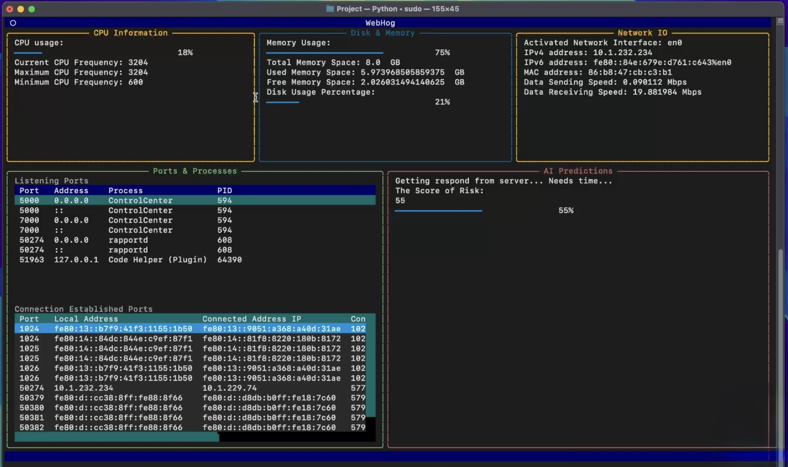

# WebHog 🐗

> Real-time network monitoring and AI-assisted anomaly detection — entirely in your terminal.



---

## What is WebHog?

Network administrators and developers have no lightweight, real-time tool that combines system monitoring, process-level port visibility, and anomaly detection in a single terminal session. Existing utilities like `netstat` and `htop` serve narrow individual purposes and provide no predictive capability.

WebHog solves this. It is a Python terminal application that monitors your system and network in real time, shows every port and process talking to the outside world, and uses an AI model to score your current network activity for risk — with a plain English explanation of why.

---

## Features

- **CPU monitoring** — per-core usage bars, current/min/max frequency
- **Memory & Disk** — accurate RAM utilisation (excluding OS cache), disk usage percentage
- **Network IO** — live send/receive speeds for your active interface, updated every second
- **Ports & Processes** — every listening port and established connection with process name and PID, scrollable and sorted
- **AI Risk Analysis** — a 0–100 risk score generated by an LLM analysing a rolling 20-second window of your network behaviour, with a reason attached for elevated scores

---

## How the AI Analysis Works

WebHog collects a network snapshot every second containing:

- Number of listening ports
- Number of established connections
- Data sent/received (MB/s)
- Net connection change since last tick
- CPU usage

Once 20 snapshots are collected (~20 seconds after launch), the window is sent as a JSON payload to an LLM via the [OpenRouter API](https://openrouter.ai). The model acts as a network security analyst and returns a risk score.

| Score | Status | Meaning |
|-------|--------|---------|
| 0 – 59 | 🟢 NORMAL | Traffic looks normal |
| 60 – 89 | 🟡 WARNING | Elevated activity — worth checking |
| 90 – 100 | 🔴 ALERT | High likelihood of anomalous activity |

For scores of 60 and above, the model returns a brief plain English explanation of what triggered the elevated score.

---

## Requirements

- Python 3.10 or later
- macOS or Linux
- `sudo` recommended — required on macOS to read connection data for all processes

---

## Installation

```bash
# Clone the repo
git clone https://github.com/Ryan-c137/Webhog.git
cd Webhog

# Install dependencies
pip install -r requirements.txt
```

---

## Usage

```bash
# Run normally
python app.py

# Run with full process visibility (recommended on macOS)
sudo python app.py
```

---

## Project Structure

```
Webhog/
├── app.py                  # Entry point — composes the full TUI layout
├── system_info_display.py  # Top row: CPU, memory, disk, network IO panels
├── ports_processes.py      # Bottom left: listening ports and established connections
├── ai_analyser.py          # Bottom right: AI risk score display widget
├── data_collector.py       # Background thread: snapshot collection and API calls
├── grabber.py              # psutil wrappers for all system data retrieval
└── gui.tcss                # Textual stylesheet for the full layout
```

---

## Dependencies

| Library | Purpose |
|---------|---------|
| [Textual](https://textual.textualize.io) | Terminal user interface framework |
| [psutil](https://psutil.readthedocs.io) | System and process information |
| [requests](https://requests.readthedocs.io) | HTTP client for the OpenRouter API |

---

## Configuration

The AI analysis uses the OpenRouter API. Replace the API key in `data_collector.py` with your own:

```python
API_key = 'your-openrouter-api-key-here'
```

Get a free key at [openrouter.ai](https://openrouter.ai). The model can also be swapped by changing the `model` field in `sender_receiver()` — any instruction-following model available on OpenRouter will work.

---

## Known Limitations

- The AI model has no memory between analysis calls — it cannot learn your machine's long-term traffic baseline
- On macOS, `sudo` is required for full process visibility; without it some connections show limited information
- The first analysis result takes ~20 seconds to appear while the snapshot window fills
- API response time is typically 1–4 seconds, introducing a short delay between an event and its detection

---

## Future Work

- Replace the API-based LLM with a locally-run Time Series Foundation Model (TSFM) such as **Chronos** or **TimesFM** for offline operation and faster inference
- Train a lightweight LSTM autoencoder on the machine's own traffic for genuine long-term baseline adaptation
- Add process kill and firewall management controls directly in the ports panel
- Persistent anomaly logging across sessions
- Package for Homebrew (macOS) and APT (Debian/Ubuntu)

---

## Academic Context

WebHog was developed as a final-year project for the Bachelor of Science in Computer Science at Massey University New Zealand.

**Author:** Ruian (Ryan) Ding  
**Supervisor:** Dr. Surangika Ranathunga, Senior Lecturer, School of Mathematical and Computational Sciences

---

## License

MIT
